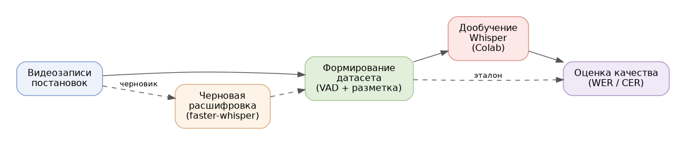

> Theatre ASR Toolkit — набор инструментов для исследования автоматического распознавания речи (Automatic Speech Recognition) в условиях театральной среды на основе моделей семейства [Whisper](https://arxiv.org/abs/2212.04356) от [OpenAI](https://openai.com/). Проект разработан в рамках курсового исследования по теме «Разработка системы автоматического текстового сопровождения театральных постановок на основе нейронных моделей распознавания речи» и направлен на повышение доступности театрального искусства для людей с нарушениями слуха.
>
> В отличие от типовых сценариев применения моделей распознавания речи, ориентированных на чистые студийные записи, театральная среда характеризуется фоновой музыкой, наложением реплик, эмоциональной окраской речи и нестабильной акустикой. Репозиторий объединяет инструменты, покрывающие полный цикл исследования: формирование размеченного набора данных на материале реальных постановок, черновую расшифровку записей, дообучение компактных моделей Whisper (`tiny`, `small`) и количественную оценку качества распознавания по метрикам WER и CER.

> Общая схема конвейера обработки данных показана ниже:
>
> 

## Overview

Проект решает прикладную задачу: оценить применимость и дообучаемость моделей Whisper для распознавания русскоязычной театральной речи. Работа построена вокруг трёх театральных постановок, для каждой из которых был сформирован собственный набор данных, а качество распознавания измерялось до и после дообучения.

Ключевая особенность подхода — наличие полного инструментария собственной разработки: от графической утилиты формирования датасета с автоматическим детектированием речевых сегментов до веб-приложения для пофрагментного сравнения расшифровок с эталоном.

## Components

| Компонент | Назначение | Технологии |
| --- | --- | --- |
| [`dataset_builder`](dataset_builder/) | Формирование набора данных: детектирование речевых сегментов и ручная разметка | WebRTC VAD, Tkinter, ffmpeg |
| [`evaluation`](evaluation/) | Оценка качества распознавания: метрики, анализ ошибок, визуализация | Streamlit, jiwer, Plotly |
| [`scripts/transcribe.py`](scripts/transcribe.py) | Черновая расшифровка видеофайлов | faster-whisper, PyTorch |
| [`scripts/normalize_text.py`](scripts/normalize_text.py) | Нормализация текста перед сравнением | Tkinter |
| [`scripts/merge_datasets.py`](scripts/merge_datasets.py) | Объединение наборов данных | pandas, Tkinter |
| [`notebooks/whisper_finetune.ipynb`](notebooks/whisper_finetune.ipynb) | Дообучение модели Whisper | Hugging Face Transformers, Google Colab |

## Getting Started

Требуется Python 3.9 или новее и установленный в системе [ffmpeg](https://ffmpeg.org/).

```bash
git clone https://github.com/jan-apakatapa/this-whisper-is-so-theatre.git
cd this-whisper-is-so-theatre

python -m venv .venv
source .venv/bin/activate        # Windows: .venv\Scripts\activate

pip install -r requirements.txt
```

Типовой сценарий работы:

1. **Сформировать набор данных** из видеозаписи постановки:
   ```bash
   python -m dataset_builder.main
   ```
   Утилита извлекает аудио, автоматически выделяет речевые сегменты и открывает окно ручной разметки. Результат сохраняется в `annotations.csv`, сегменты — в каталог `data/segments`.

2. **(Опционально) Получить черновую расшифровку** для ускорения разметки:
   ```bash
   python scripts/transcribe.py
   ```

3. **Очистить пустые аннотации** после разметки:
   ```bash
   python -m dataset_builder.clean_annotations annotations.csv
   ```

4. **Дообучить модель** — см. тетрадь [`notebooks/whisper_finetune.ipynb`](notebooks/whisper_finetune.ipynb) (рассчитана на запуск в Google Colab с GPU).

5. **Оценить качество распознавания**:
   ```bash
   streamlit run evaluation/app.py
   ```
   Приложение принимает три транскрипции (эталон, вывод Whisper Tiny и Small) и выводит метрики WER и CER, анализ ошибок, частоту галлюцинаций и инструменты пофрагментного сравнения.

## Project Structure

```
this-whisper-is-so-theatre/
├── dataset_builder/             # Утилита формирования набора данных
│   ├── main.py                  #   точка входа (GUI)
│   ├── main_window.py           #   главное окно
│   ├── audio_utils.py           #   извлечение аудио (ffmpeg)
│   ├── segmenter.py             #   детектирование речевых сегментов (VAD)
│   ├── annotation_window.py     #   ручная разметка сегментов
│   ├── exporter.py              #   экспорт в CSV
│   ├── clean_annotations.py     #   очистка пустых аннотаций
│   └── models.py                #   структуры данных
├── evaluation/                  # Инструмент оценки качества (Streamlit)
│   ├── app.py                   #   веб-приложение
│   ├── chunking.py              #   разбиение текста на фрагменты
│   ├── metrics.py               #   метрики WER, CER, анализ ошибок
│   ├── visualization.py         #   визуализация результатов
│   └── utils.py                 #   вспомогательные функции
├── scripts/                     # Самостоятельные утилиты
│   ├── transcribe.py            #   черновая расшифровка (faster-whisper)
│   ├── normalize_text.py        #   нормализация текста
│   └── merge_datasets.py        #   объединение наборов данных
├── notebooks/
│   └── whisper_finetune.ipynb   # Дообучение Whisper (Google Colab)
├── imgs/
├── requirements.txt
├── LICENSE
└── README.md
```

## Metrics

Качество распознавания оценивается по двум основным метрикам:

- **WER (Word Error Rate)** — частота ошибок на уровне слов, вычисляется как отношение суммы подстановок, вставок и удалений к общему числу слов эталона;
- **CER (Character Error Rate)** — частота ошибок на уровне символов; информативна для флективных языков, к которым относится русский.

Дополнительно вычисляются детализированная статистика ошибок (подстановки, вставки, удаления) и частота галлюцинаций модели — доля порождённых слов, отсутствующих в исходном аудиосигнале.

## Author

Проект разработан в рамках курсового исследования.

**Бородаенко Ева** — автор исследования и кода.
Код был написан с помощью Github Copilot, Claude Haiku 4.5 и GPT-4.1
Научный руководитель: **Фирсанова Виктория Игоревна**, старший преподаватель департамента филологии.

Национальный исследовательский университет «Высшая школа экономики», Санкт-Петербург, 2026.
