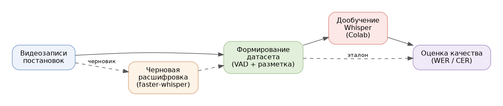

# Theatre ASR Toolkit

[Русская версия](README.ru.md)

Tools for studying automatic speech recognition (ASR) of Russian theatrical speech with OpenAI's [Whisper](https://arxiv.org/abs/2212.04356) models. The goal is accessible theatre: automatic captions for deaf and hard-of-hearing audiences.

Most ASR benchmarks use clean studio recordings. Theatre audio is different: background music, overlapping lines, emotionally charged delivery and unstable acoustics. This repository covers the full research cycle — building an annotated dataset from real performance recordings, draft transcription, fine-tuning compact Whisper models (`tiny`, `small`), and evaluating recognition quality with WER and CER.



## Research question

How well do Whisper models transcribe Russian theatrical speech out of the box, and how much does fine-tuning on in-domain data help? The study covers three stage productions: a fully manual reference exists for one, aligned datasets are being built for the others.

## Results so far

### Stage 1: baseline and first fine-tuning

Numbers are for *Masquerade* (Alexandrinsky Theatre), the production with a complete manually annotated reference.

| Model | WER | CER |
| --- | --- | --- |
| Whisper tiny, zero-shot | 53.0% | 26.6% |
| Whisper tiny, fine-tuned | 65.7% | 37.7% |
| Whisper small, zero-shot | 32.9% | 17.9% |
| Whisper small, fine-tuned | 43.8% | 27.8% |
| Whisper large-v3, zero-shot | 18.3% | — |

With about 400 in-domain segments and a random train/test split, fine-tuning `tiny` and `small` consistently increased error rates — a clear case of overfitting on a small dataset.

### Stage 2: annotation by alignment

Manual annotation is the main bottleneck, so datasets are now labelled automatically by aligning Whisper output with the play script. On *Masquerade*, these automatic labels reach 11.5% WER against the manual reference, compared with 18.3% for raw Whisper large-v3 output.

### Stage 3: fine-tuning on aligned data

Whisper small with a frozen encoder was fine-tuned on the first 80% of *Masquerade* and tested on two sets it had never seen: the final 20% of the same performance (different scenes) and a different production, *Dream of Autumn* (Lensovet Theatre).

| Test set | WER before | WER after | Change |
| --- | --- | --- | --- |
| *Masquerade*, final 20% (unseen scenes) | 25.5% | 23.8% | −1.7 |
| *Dream of Autumn* (unseen production) | 38.4% | 64.2% | +25.8 |

For the first time, fine-tuning did not hurt within the same production: WER dropped slightly on unseen scenes. The gain is small and the test set is short (42 segments, about 6 minutes), so it may be within noise. On a different production, however, performance dropped sharply: the model adapted to one performance and lost generality. Next steps: training on several productions at once, fewer training steps and parameter-efficient methods.

Note: the *Dream of Autumn* reference was produced by the alignment method, not by full manual annotation.

## Components

| Component | Purpose | Stack |
| --- | --- | --- |
| [`dataset_builder`](dataset_builder) | Dataset creation: speech segment detection and manual annotation | WebRTC VAD, Tkinter, ffmpeg |
| [`evaluation`](evaluation) | Evaluation: metrics, error analysis, visualisation | Streamlit, jiwer, Plotly |
| [`scripts/transcribe.py`](scripts/transcribe.py) | Draft transcription of video recordings | faster-whisper, PyTorch |
| [`scripts/normalize_text.py`](scripts/normalize_text.py) | Text normalisation before comparison | Tkinter |
| [`scripts/merge_datasets.py`](scripts/merge_datasets.py) | Merging datasets | pandas, Tkinter |
| [`notebooks/whisper_finetune.ipynb`](notebooks/whisper_finetune.ipynb) | Fine-tuning Whisper | Hugging Face Transformers, Google Colab |

## Getting started

Requires Python 3.9+ and [ffmpeg](https://ffmpeg.org/) installed on your system.

```bash
git clone https://github.com/jan-apakatapa/this-whisper-is-so-theatre.git
cd this-whisper-is-so-theatre

python -m venv .venv
source .venv/bin/activate        # Windows: .venv\Scripts\activate

pip install -r requirements.txt
```

Typical workflow:

1. **Build a dataset** from a performance recording:

   ```bash
   python -m dataset_builder.main
   ```

   The tool extracts audio, detects speech segments automatically and opens a manual annotation window. Annotations are saved to `annotations.csv`, segments to `data/segments`.

2. **(Optional) Get a draft transcription** to speed up annotation:

   ```bash
   python scripts/transcribe.py
   ```

3. **Remove empty annotations**:

   ```bash
   python -m dataset_builder.clean_annotations annotations.csv
   ```

4. **Fine-tune the model** with [`notebooks/whisper_finetune.ipynb`](notebooks/whisper_finetune.ipynb) (designed for Google Colab with a GPU).

5. **Evaluate recognition quality**:

   ```bash
   streamlit run evaluation/app.py
   ```

   The app takes three transcriptions (reference, Whisper tiny, Whisper small) and reports WER and CER, error breakdown, hallucination rate and segment-by-segment comparison.

## Project structure

```
this-whisper-is-so-theatre/
├── dataset_builder/             # Dataset creation tool
│   ├── main.py                  #   entry point (GUI)
│   ├── main_window.py           #   main window
│   ├── audio_utils.py           #   audio extraction (ffmpeg)
│   ├── segmenter.py             #   speech segment detection (VAD)
│   ├── annotation_window.py     #   manual segment annotation
│   ├── exporter.py              #   CSV export
│   ├── clean_annotations.py     #   empty annotation cleanup
│   └── models.py                #   data structures
├── evaluation/                  # Evaluation tool (Streamlit)
│   ├── app.py                   #   web app
│   ├── chunking.py              #   text chunking
│   ├── metrics.py               #   WER, CER, error analysis
│   ├── visualization.py         #   result visualisation
│   └── utils.py                 #   helpers
├── scripts/                     # Standalone utilities
│   ├── transcribe.py            #   draft transcription (faster-whisper)
│   ├── normalize_text.py        #   text normalisation
│   └── merge_datasets.py        #   dataset merging
├── notebooks/
│   └── whisper_finetune.ipynb   # Whisper fine-tuning (Google Colab)
├── imgs/
├── requirements.txt
├── LICENSE
└── README.md
```

## Metrics

- **WER (Word Error Rate)** — substitutions, insertions and deletions divided by the number of words in the reference.
- **CER (Character Error Rate)** — the same at character level; more informative for inflected languages such as Russian.

The evaluation tool also reports a detailed error breakdown and the model's **hallucination rate**: the share of generated words that are absent from the audio.

## About the project

Developed as undergraduate research at HSE University, St Petersburg (2026): *Developing an automatic captioning system for theatre performances based on neural speech recognition models*. The work continues as a bachelor's thesis.

**Author:** Eva Borodaenko
**Supervisor:** Victoria Firsanova, Senior Lecturer, Department of Philology, HSE University

Parts of the code were written with the help of AI coding assistants (GitHub Copilot, Claude Haiku 4.5, GPT-4.1).

## License

See [LICENSE](LICENSE).
